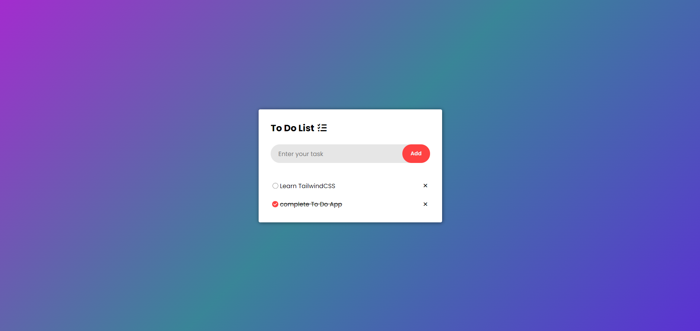

# To-Do List App

A simple and responsive To-Do List application built using HTML, CSS, and JavaScript.

This project allows users to add, complete, and delete tasks while storing data locally using the browser's localStorage feature.

## Features

- Add new tasks
- Mark tasks as completed
- Delete tasks
- Save tasks using localStorage
- Persistent data after page refresh
- Responsive and modern UI

## Technologies Used

- HTML
- CSS
- JavaScript

## Preview



## Project Structure

```bash
todo-list/
│
├── index.html
├── style.css
├── script.js
├── assets/
│   ├── checked.png
│   └── unchecked.png
├── screenshot.png
└── README.md
```

## What I Learned

- DOM Manipulation
- Event Delegation
- Dynamic Element Creation
- Error Handling
- Local Storage
- State Persistence
- Responsive UI Design


## Future Improvements

- Edit existing tasks
- Dark/Light theme
- Drag and drop task sorting
- Task filters (Completed / Pending)

## Author

**Kunal Sambyal**

## Support

If you found this project useful, consider giving it a ⭐ on GitHub.
